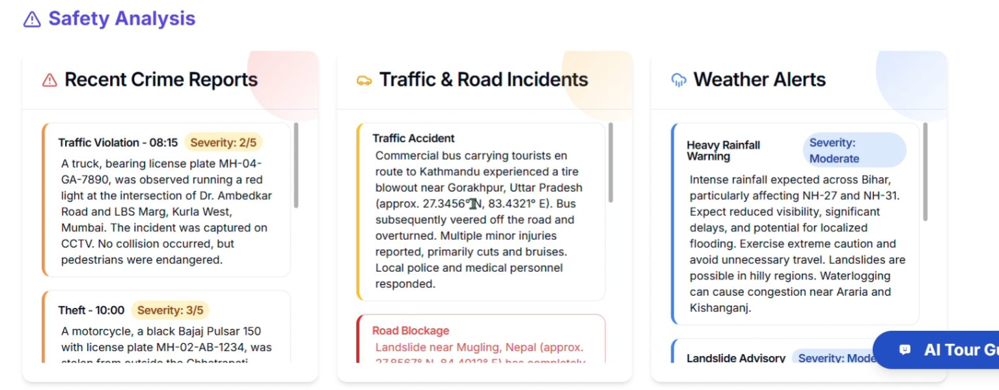
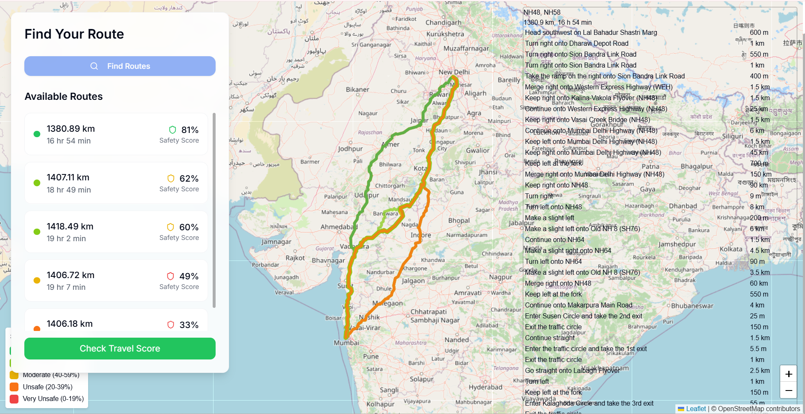
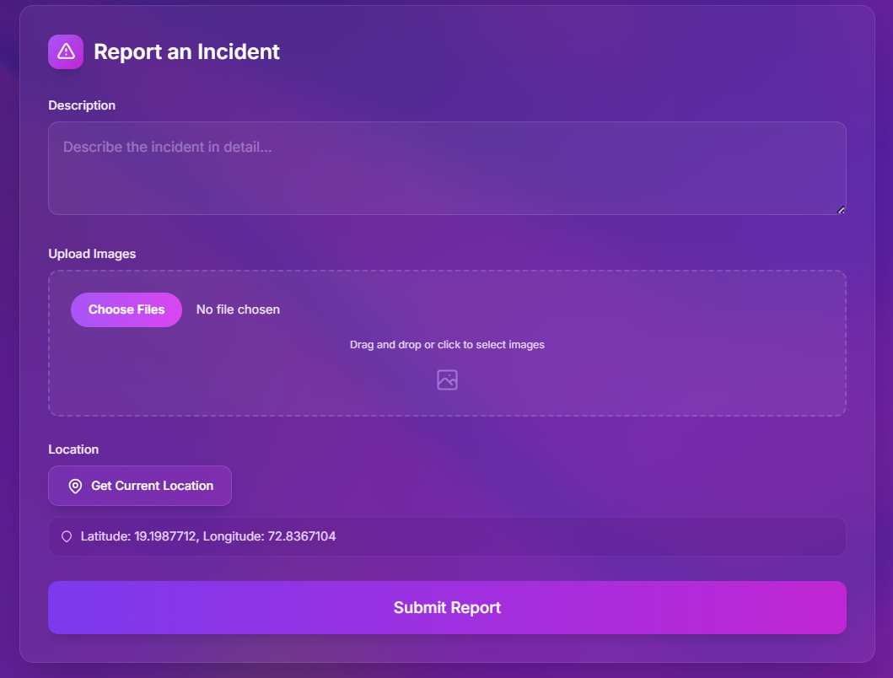
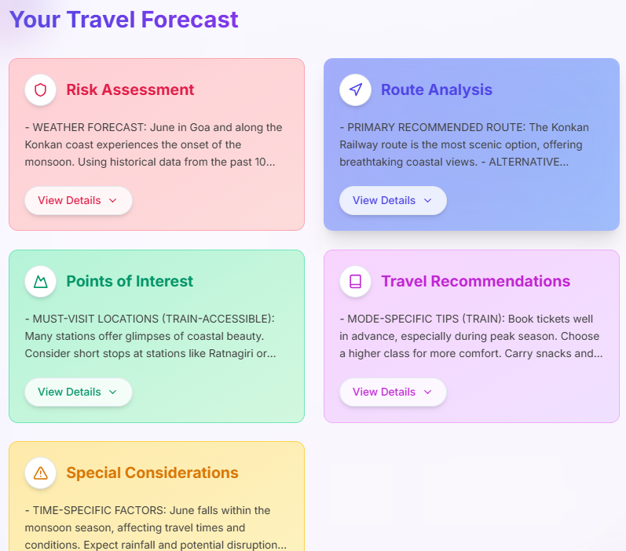
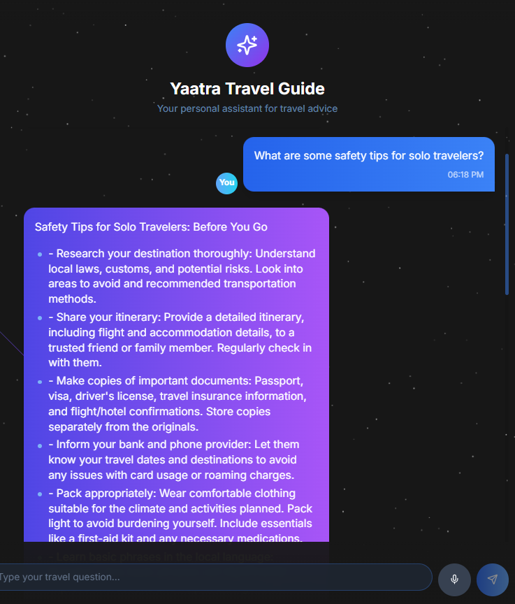
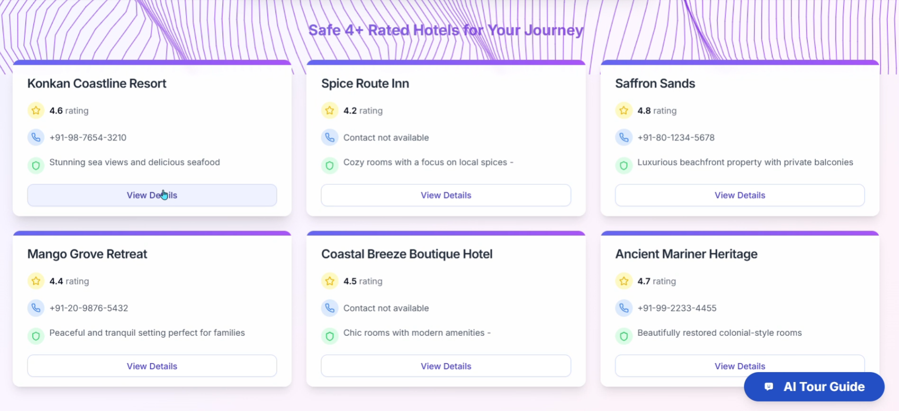

<html lang="en">
 <body>
   <h1>🌐 PlanMyTrip – Personalized Itinerary & Safety Planner ✈️🗺️</h1>

   <h2>🌍 Overview</h2>
   

     <strong>PlanMyTrip</strong> is an innovative, real-time travel planning and safety platform that empowers users with detailed, location-based insights. It combines the power of crowdsourcing, AI and interactive mapping to offer a smarter and safer travel experience. From crime hotspots to weather alerts and AI risk forecasting, this tool ensures that your journey is not just personalized — but protected.
   

   

     Built using modern web technologies like <strong>React + Vite</strong>, <strong>Node.js + Express</strong>, <strong>MongoDB</strong>, and enhanced with <strong>Google Gemini LLM</strong> for smart conversations, it seamlessly integrates <strong>OpenStreetMap</strong> for an intuitive travel interface filled with real-time visuals and helpful emojis 🌦️📍🛡️.
   

   <h3>🚨 1. Real-Time Crime & Safety Insights</h3>
   <ul>
     <li>Continuously monitors local crime reports, incidents, and government alerts in real time 🔁.</li>
     <li>Provides users with multiple travel route options, along with estimated travel times 🛣️⏱️.</li>
     <li>Safety scores for different areas are dynamically calculated and color-coded on an interactive map 🗺️.</li>
     <li>Helps travelers avoid high-risk zones and take smarter, safer routes 👣.</li>
     <li></li>
   </ul>

   <h3>🤖 2. AI-Powered Route Safety Scoring</h3>
   <ul>
     <li>Combines crime, traffic, weather, and hazard data to assign a “Safety Score” to each route 🚘⚠️.</li>
     <li>AI recommends alternate paths that are both faster and safer for travel decisions on-the-go 📡.</li>
     <li>Heatmaps and visuals show route safety levels in real-time 🌡️.</li>
     <li></li>
   </ul>

   <h3>🛡️ 3. Crowdsourced Safety Reports </h3>
   <ul>
     <li>Users can report live events such as protests, unsafe neighborhoods, or blocked roads 📝.</li>
     <li>These verified reports are added into the live safety scoring system for all users 🔄.</li>
     <li></li>
   </ul>

   <h3>🔮 4. AI-Based Travel Risk Forecasting</h3>
   <ul>
     <li>Predicts potential safety threats before they occur using trained AI models 📊🤖.</li>
     <li>Analyzes crime and weather trends to forecast safe vs unsafe areas in the future ⛈️🛑.</li>
     <li>Perfect for long-distance or advance trip planning with fewer surprises 🎯.</li>
     <li></li>
   </ul>

   <h3>💬 5. AI Travel Chatbot Buddy</h3>
   <ul>
     <li>Always-on assistant helps users navigate, get safety tips, and access emergency info 📞.</li>
     <li>Responds to questions like “Is this area safe right now?” or “Suggest an alternate route” 📍🧭.</li>
     <li>Gives location-based info like nearest police stations, hospitals, or hotels 🏥🚓.</li>
     <li></li>
   </ul>

   <h3>🏨 6. Smart Hotel Finder (Safety + Comfort)</h3>
   <ul>
     <li>Find nearby hotels rated not just on comfort, but also on safety metrics 📶🛏️.</li>
     <li>AI recommends places with good user reviews, secure environments, and emergency proximity 🚨.</li>
     <li>Sort/filter hotels based on features like 24/7 security, CCTV access, or medical assistance 📋.</li>
     <li></li>
   </ul>

   <h2>🚀 Tech Stack</h2>
   <ul>
     <li><strong>Frontend:</strong> React + Vite ⚡</li>
     <li><strong>Backend:</strong> Node.js + Express 🧠</li>
     <li><strong>Database:</strong> MongoDB 🍃</li>
     <li><strong>Maps:</strong> OpenStreetMap+ Leaflet + Custom Icons 🗺️</li>
     <li><strong>Weather:</strong> OpenWeatherMaps API ☁️</li>
     <li><strong>AI:</strong> Google Gemini LLM 💡</li>
   </ul>

   <h2>🔗 Live Demo & Repository</h2>
   

     👉 <strong>Live Demo:</strong> [Your hosted link here]  
     💻 <strong>GitHub Repo:</strong> [Your repo link here]
   

 </body>
</html>
